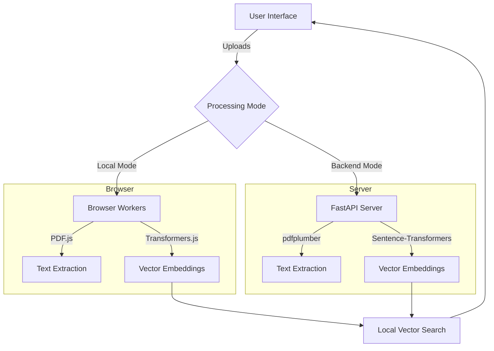

# Industrial Document Retrieval System 🏭

An advanced, AI-powered system for indexing, searching, and analyzing industrial documentation (PDFs, Word Docs, Technical Schematics). Built with a modern React frontend and a robust Python backend, offering flexible **Browser-Only** or **Client-Server** deployment modes.

##  Features

- **📄 Universal File Support**: 
  - Extracts text from **PDFs** (technical manuals)
  - **DOCX** (specifications)
  - **Images** (OCR for schematics/diagrams using Tesseract)

- ** Semantic Search**:
  - Goes beyond keyword matching. Understands the *meaning* of your query.
  - Powered by the **all-MiniLM-L6-v2** Sentence Transformer model.
  - Vector similarity search (Cosine Similarity).

- ** Automated Entity Extraction**:
  - Automatically identifies and tags:
    - **Part Numbers** (e.g., `BLT-M8-200`)
    - **Measurements** (e.g., `200 mm`, `45.2 g`)
    - **Prices** & **Dates**
    - **Specifications** (e.g., `800 MPa`)

- ** Hybrid Architecture**:
  - **Local-Only Mode**: Runs entirely in the browser using WebAssembly & Transformers.js. No server required.
  - **Python Backend Mode**: Powerful FastAPI server for heavy-duty processing and batch operations.

##  Tech Stack

### Frontend
- **Framework**: [React](https://react.dev/) + [Vite](https://vitejs.dev/)
- **Language**: TypeScript
- **ML (In-Browser)**: [Transformers.js](https://huggingface.co/docs/transformers.js/)
- **Extraction**: `pdfjs-dist`, `mammoth`, `tesseract.js`
- **UI**: Tailwind CSS, Lucide Icons

### Backend (Optional)
- **Framework**: [FastAPI](https://fastapi.tiangolo.com/)
- **ML (Server)**: `sentence-transformers` (PyTorch)
- **Extraction**: `pdfplumber`, `python-docx`, `pytesseract`
- **Storage**: Local JSON / SQLite

---

##  Getting Started

### Prerequisites

- **Node.js**: v18+
- **Python**: v3.10+ (for backend)
- **Tesseract OCR**: (Optional, for image processing)

###  Frontend Setup (Required)

The frontend provides the user interface and can access the backend or run in standalone mode.

```bash
# Clone the repository
git clone <repository-url>
cd project

# Install dependencies
npm install

# Start the development server
npm run dev
```

The app will launch at `http://localhost:5173`.

### Backend Setup (Optional)

For more robust processing, run the Python backend.

```bash
# Navigate to backend directory
cd backend

# Create virtual environment (recommended)
python -m venv venv
source venv/bin/activate  # On Windows: venv\Scripts\activate

# Install dependencies
pip install -r requirements.txt

# Start the server
python main.py
```

The server will be available at `http://localhost:8000`.

---

## Usage Guide

### Mode 1: Local-Only (Browser)
By default, the application runs in **Local-Only Mode**.
1. Open the app (`http://localhost:5173`).
2. Click **Upload** to select files.
3. Click **Upload & Process** to analyze them in-memory.
4. Use the search bar to find information or view extracted entities in the **Document Viewer**.

> **Note**: In this mode, data exists only in your browser session. Refreshing clears the data (metadata is persisted in LocalStorage).

### Mode 2: Client-Server (Python)
To switch to the Python backend:
1. Ensure the Python server is running (`http://localhost:8000`).
2. Use the application as normal. Note: The frontend integration requires pointing configuration to `http://localhost:8000`.
   *(UI toggle coming soon - currently defaults to local processing logic)*

## Architecture Overview



## Contributing

1. Fork the Project
2. Create your Feature Branch (`git checkout -b feature/AmazingFeature`)
3. Commit your Changes (`git commit -m 'Add some AmazingFeature'`)
4. Push to the Branch (`git push origin feature/AmazingFeature`)
5. Open a Pull Request

## License

Distributed under the MIT License. See `LICENSE` for more information.
